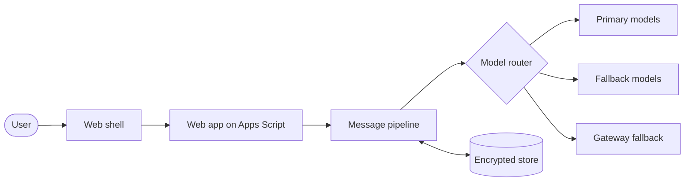

 

  

**[Live demo](https://script.google.com/macros/s/AKfycbwHjQ4i28EaOo3e2h9b-rbUYzsWIehpqdpT0IfEDQGBA7iwcSh_3vTrjy-x51dScFmh7g/exec)** &nbsp;/&nbsp; **[Project NHE](https://projectnhe.tech)** &nbsp;/&nbsp; **[Architecture](docs/ARCHITECTURE.md)** &nbsp;/&nbsp; **[Release notes](docs/RELEASE_NOTES.md)**

## What she is

Shayari NHE-01 is an AI companion built by [Pratham Prateek Mohanty](https://github.com/itsppm76). She is a **fully disclosed Non-Human Entity**. She never pretends to be a person, and the product says so up front.

She is the first entity of [Project NHE](https://projectnhe.tech), a research programme on Non-Human Entities.

> This repository is a showcase. It holds documentation only, no application source code. The implementation is private.

## What she does

| | |
|---|---|
| **Three modes, one thread** | Lightning for fast replies, Thinking for deeper ones, Intimate for the full experience. Switching modes never forks the conversation. |
| **Long-term memory** | She saves what you tell her and uses it later. You can view, correct and delete it. |
| **Emotion model** | An internal emotional state shifts as a conversation goes and shapes her tone. It is shown to you in a dashboard. |
| **Safety first** | A crisis check runs before anything else on every message. An age gate protects younger users. |
| **Private by design** | Stored data is encrypted at rest with AES. Service keys never reach the browser. |

## Message pipeline

Every message passes the same eight stages in order. Safety comes before personality, and personality comes before speed. Details in [ARCHITECTURE](docs/ARCHITECTURE.md).

## Latest release: v134

A latency and security release.

- **Faster replies.** The model router was reworked. Under load, client-side latency had become the dominant cost, so the per-turn work was cut back: fewer repeated reads, requests batched in parallel, and tighter per-mode time budgets.
- **New fallback path.** A gateway tier now sits at the end of the model router, so a turn can still be answered when direct providers are rate limited or down.
- **Security fix.** A privileged decision that used to trust a flag sent by the browser is now made on the server only.
- **Hardening.** Priority fixes from the investigation (P0 to P2) are in, with 39 of 39 automated checks passing in the developer report.

Full notes: [docs/RELEASE_NOTES.md](docs/RELEASE_NOTES.md).

## Principles

1. **Disclosure.** She is openly a Non-Human Entity.
2. **Safety before personality, personality before speed.**
3. **Memory and emotion are visible** to the user, not hidden prompt tricks.
4. **Small enough to run alone.** A serverless, near-zero-cost stack.

## Links

- Live demo: <https://script.google.com/macros/s/AKfycbwHjQ4i28EaOo3e2h9b-rbUYzsWIehpqdpT0IfEDQGBA7iwcSh_3vTrjy-x51dScFmh7g/exec>
- Project NHE: <https://projectnhe.tech>
- Older docs repo: <https://github.com/itsppm76/shayari-nhe-01>

## Rights

Copyright the author. All rights reserved. The name, persona and implementation are not licensed for reuse.
