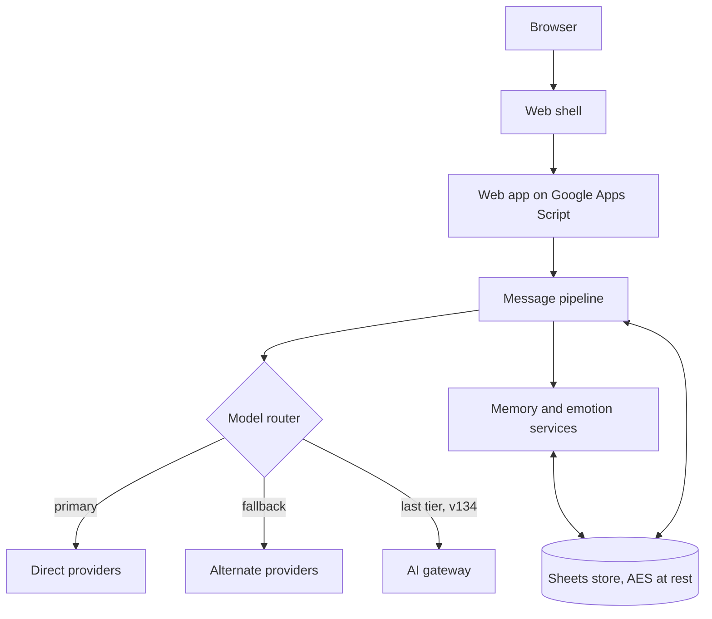

# Architecture overview

A high-level view only. Implementation details, prompts, configuration and credentials are not published.

## Components

## Message pipeline

Each user message goes through these stages, in order:

1. **Safety check.** A crisis check runs first and overrides everything else.
2. **Access and limits.** Plan, usage limits and age protections are applied.
3. **Commands.** Slash commands such as memory management are handled directly.
4. **Optional inputs.** Image understanding and a decision on whether web search helps.
5. **Context building.** Depends on the mode: recent turns only, or summaries and profile, or the full stack with top-ranked long-term memories.
6. **Emotion update.** The internal emotional state is adjusted.
7. **Generation.** The model router picks a model and falls back if one fails. Since v134 a gateway tier is the last fallback, and per-mode time budgets keep a slow provider from stalling the turn.
8. **Persistence.** The turn is saved and memories are updated.

## Modes

| Mode | Purpose | Context used |
|---|---|---|
| Lightning | Fast, light replies | Short rolling history |
| Thinking | Deeper replies | Profile and conversation summary |
| Intimate | Fullest experience | Full stack including ranked long-term memory and emotion |

All modes share one ordered conversation thread, so history and memories carry across mode changes.

## Data and security

- Google Sheets stores users, conversations and memory.
- Stored data is encrypted at rest with AES.
- Model and service keys stay on the server and are never sent to the browser.
- Since v134, privileged decisions are made on the server only. The browser is never trusted to say what it is allowed to do.
- Users can inspect and delete what Shayari remembers about them.

## Design principles

- Disclosure: she is openly a Non-Human Entity.
- Safety before personality, personality before speed.
- Memory and emotion are visible to the user.
- Keep the stack simple enough to run and maintain alone.
